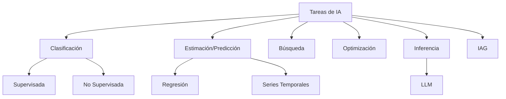
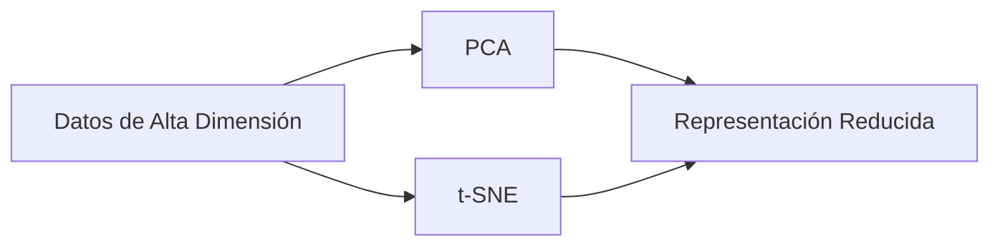
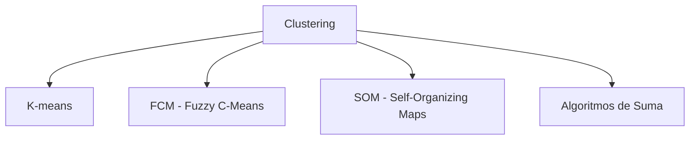
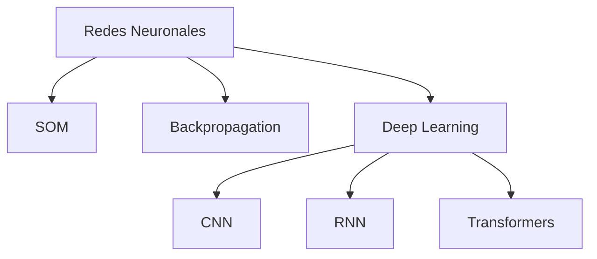
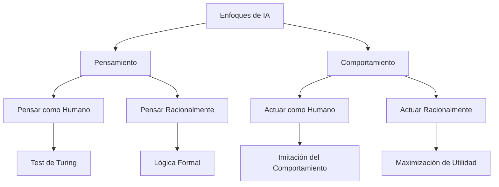
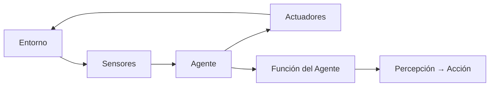
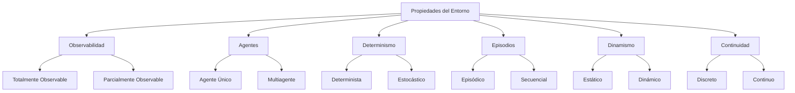
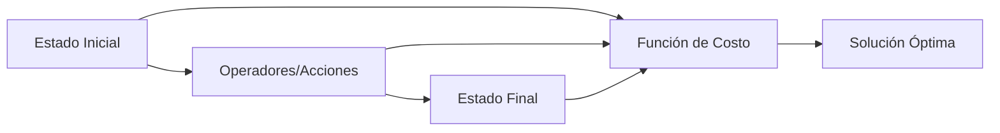
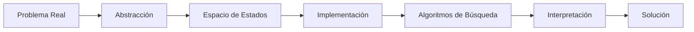
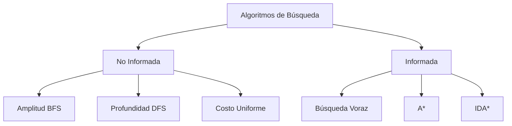

# Agentes Inteligentes

## 1. Principales Tareas de IA

### 1.1 Clasificación de Tareas

- **Clasificación**: Asignación de categorías a datos
- **Estimación/Predicción**: Proyección de valores futuros
- **Búsqueda**: Exploración del espacio de soluciones
- **Optimización**: Maximización/minimización de funciones objetivo
- **Inferencia**: Deducción de conclusiones a partir de datos
- **IAG (Inteligencia Artificial General)**: Capacidades cognitivas equivalentes a humanos

## 2. Machine Learning

### 2.1 Técnicas de Encoding

- **PCA (Principal Component Analysis)**: Reducción lineal de dimensionalidad
- **t-SNE**: Reducción no lineal para visualización

### 2.2 Algoritmos de Clustering

- **K-means**: Algoritmo de particionamiento que divide datos en k clusters mediante la minimización de la suma de distancias cuadráticas dentro de cada cluster. Cada punto pertenece al cluster cuyo centroide está más cercano.

- **FCM (Fuzzy C-Means)**: Extensión difusa de K-means donde cada punto puede pertenecer a múltiples clusters con diferentes grados de membresía (valores entre 0 y 1), permitiendo transiciones suaves entre clusters.

- **SOM (Self-Organizing Maps)**: Red neuronal no supervisada que produce una representación discreta y de baja dimensión del espacio de entrada, preservando la topología mediante aprendizaje competitivo.

- **Algoritmos de Suma**: Métodos que agrupan datos basándose en la suma de similitudes o distancias, optimizando funciones objetivo aditivas para formar clusters cohesivos.

### 2.3 Redes Neuronales

- **SOM (Self-Organizing Maps)**: Red neuronal no supervisada que organiza datos de alta dimensión en mapas bidimensionales, preservando relaciones topológicas mediante aprendizaje competitivo entre neuronas.

- **Backpropagation (BP)**: Algoritmo de entrenamiento supervisado que ajusta pesos de la red propagando errores hacia atrás desde la salida hasta las capas de entrada, utilizando el descenso de gradiente.

- **Deep Learning**: Arquitecturas de redes neuronales con múltiples capas ocultas que aprenden representaciones jerárquicas de datos, capaces de modelar patrones complejos y abstracciones de alto nivel.

- **CNN (Convolutional Neural Networks)**: Redes especializadas en procesamiento de datos con estructura de grilla (imágenes), utilizando convolución, pooling y capas totalmente conectadas para extracción de características.

- **RNN (Recurrent Neural Networks)**: Redes con conexiones recurrentes que mantienen memoria interna, diseñadas para procesar secuencias de datos con dependencias temporales.

- **Transformers**: Arquitectura basada en mecanismos de atención que procesa secuencias en paralelo, eliminando la necesidad de recurrencia y destacando en tareas de procesamiento de lenguaje natural.

## 3. Interpretación de la IA según Russell

### 3.1 Definición Basada en Agentes

La IA se entiende como el estudio de **agentes inteligentes**: sistemas que perciben su entorno y toman decisiones para maximizar su éxito.

### 3.2 Enfoques Históricos

## 4. Qué es un Agente

### 4.1 Definición

Sistema capaz de:

- **Percibir** su entorno mediante sensores
- **Procesar** percepciones
- **Actuar** racionalmente usando actuadores
- **Lograr** objetivos específicos

### 4.2 Arquitectura Básica de un Agente

### 4.3 Tipos de Agentes

#### Agentes Virtuales

- **Conversacionales**: ChatGPT, Alexa, Siri
- **Recomendación**: Netflix, Spotify, Amazon
- **Trading Financiero**: Wealthfront, Robinhood AI

#### Agentes Físicos

- **Vehículos Autónomos**: Tesla Autopilot, Waymo
- **Robots Industriales**: Baxter, KUKA
- **Drones Inteligentes**: DJI Phantom, Skydio

## 5. Racionalidad en Agentes

### 5.1 Enfoques de Racionalidad

#### Herbert Simon: Racionalidad Limitada
>
> "Los agentes toman decisiones racionales dentro de los límites de la información disponible"

#### Russell y Norvig: Agentes Racionales
>
> "Un agente racional actúa para lograr el mejor resultado esperado dado lo que sabe"

#### Racionalidad Híbrida

Integra eficiencia algorítmica con valores humanos, complementando (no reemplazando) el juicio humano.

## 6. Conceptos Fundamentales

### 6.1 Definiciones Clave

#### Omnisciencia

- **Definición**: Conocimiento completo de toda la información relevante
- **Ejemplo**: Un agente de trading con acceso completo a datos del mercado
- **Realidad**: Imposible en la práctica

#### Aprendizaje

- **Definición**: Mejora del rendimiento a través de la experiencia
- **Ejemplo**: AlphaGo mejorando mediante autoplay
- **Tipos**: Supervisado, no supervisado, por refuerzo

#### Autonomía

- **Definición**: Capacidad de operar sin intervención externa
- **Ejemplo**: Robot de limpieza Roomba navegando independientemente
- **Grados**: Desde semiautónomo hasta completamente autónomo

## 7. Propiedades de Entornos

### 7.1 Clasificación de Entornos

### 7.2 Ejemplos por Tipo de Entorno

| Entorno | Observabilidad | Agentes | Determinismo | Episodios | Dinamismo |
|---------|---------------|---------|--------------|-----------|-----------|
| Ajedrez | Total | Multi | Determinista | Secuencial | Estático |
| Poker | Parcial | Multi | Estocástico | Secuencial | Estático |
| Taxi Autónomo | Parcial | Multi | Estocástico | Secuencial | Dinámico |

## 8. Resolución de Problemas

### 8.1 Definición Formal de un Problema

#### Componentes

1. **Estado inicial**: Punto de partida
2. **Operadores**: Acciones disponibles
3. **Estado objetivo**: Meta a alcanzar
4. **Función de costo**: Asignación de costos a las acciones

### 8.2 Proceso de Resolución

## 9. Algoritmos de Búsqueda

### 9.1 Características de Evaluación

- **Completitud**: ¿Garantiza encontrar solución si existe?
- **Optimalidad**: ¿Encuentra la mejor solución?
- **Complejidad temporal**: Tiempo de ejecución
- **Complejidad espacial**: Memoria requerida

### 9.2 Clasificación de Algoritmos

### 9.3 Comparación de Algoritmos

| Algoritmo | Completo | Óptimo | Tiempo | Espacio |
|-----------|----------|--------|--------|---------|
| BFS | Sí | Sí* | O(b^d) | O(b^d) |
| DFS | No** | No | O(b^m) | O(bm) |
| A* | Sí | Sí | O(b^d) | O(b^d) |

*Si costos uniformes  
**En espacios infinitos

---
