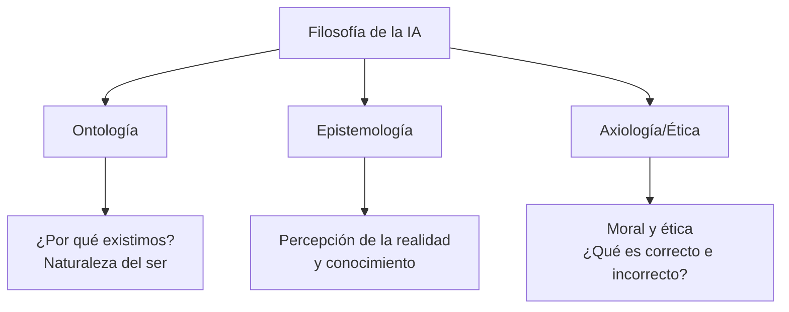
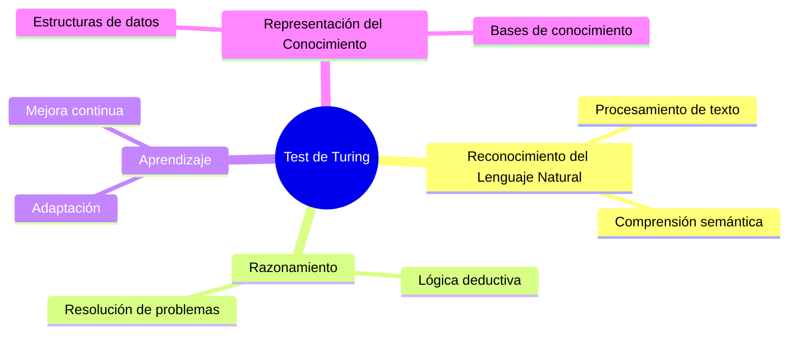
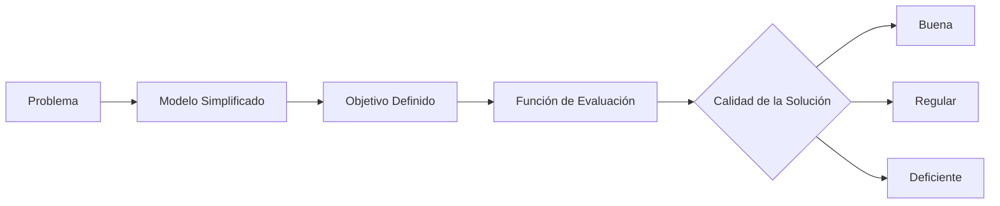
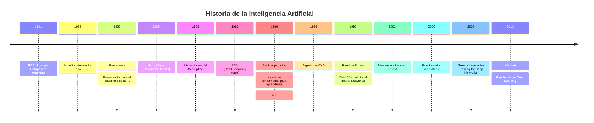
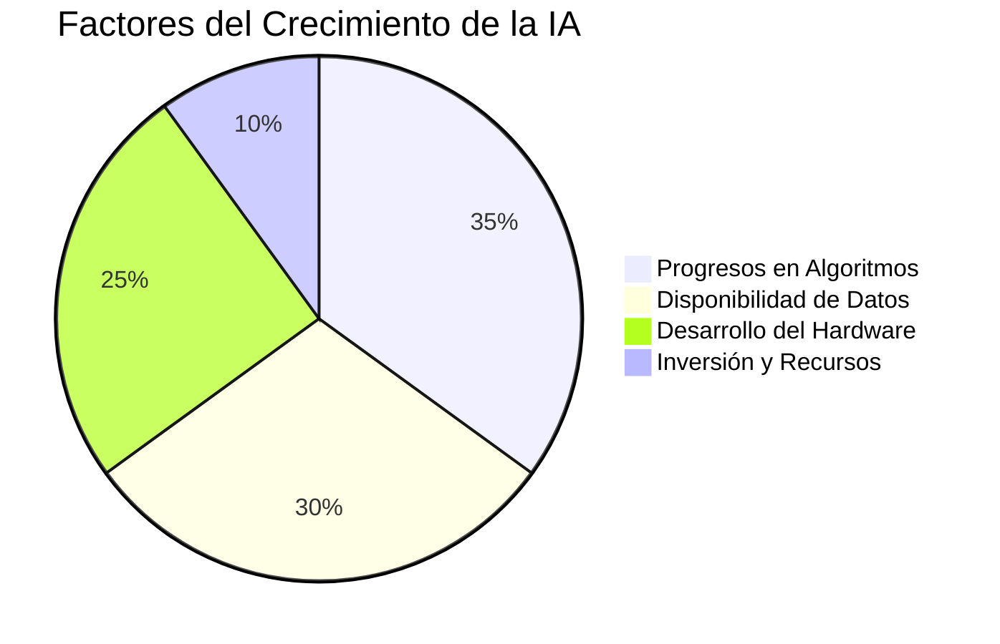

# Introducción a la Inteligencia Artificial - Clase 1

## Tabla de Contenidos

1. [Fundamentos Filosóficos de la IA](#fundamentos-filosóficos-de-la-ia)

2. [El Test de Turing](#test-de-turing)

3. [Métodos de Investigación](#métodos-de-investigación)

4. [Historia de la IA](#historia-de-la-ia)

5. [¿Por qué tanto interés en la IA?](#por-qué-tanto-interés-en-la-ia)

---

## Fundamentos Filosóficos de la IA

### Ramas de la Filosofía aplicadas a la IA

### **Ética en IA - Puntos Clave**

- Democracia y participación ciudadana
- Transparencia en algoritmos
- Sesgo y equidad
- Privacidad y derechos digitales

### Experimentos Filosóficos Importantes

- **Test de Turing (1950)**: ¿Puede una máquina pensar?
- **Habitación China (John Searle)**: Crítica al test de Turing sobre comprensión vs. simulación

---

## Test de Turing

> **Definición**: El primer intento formal de definir inteligencia artificial, propuesto por Alan Turing en 1950.

### Capacidades Requeridas para el Test de Turing Básico

### Test de Turing Total (Capacidades Adicionales)

- **Visión Artificial**: Procesamiento e interpretación de imágenes
- **Robótica**: Manipulación física del entorno

### 📝 **Tarea Pendiente**
>
> Buscar ejemplos específicos de cada capacidad del Test de Turing en sistemas de IA actuales.

---

## Métodos de Investigación

### Enfoques Científicos en IA

| Método Deductivo | Método Inductivo |
|------------------|------------------|
| 1. Teoría | 1. Observación |
| 2. Hipótesis | 2. Identificación de patrones |
| 3. Observaciones | 3. Hipótesis tentativa |
| 4. Confirmación | 4. Teoría |

> **Nota Importante**: La calidad de la función de evaluación determina directamente la calidad de la solución obtenida.

---

## Historia de la IA

### Timeline de Desarrollos Clave

### **Hitos Más Importantes**

1. **1950 - Perceptrón**: Base de las redes neuronales modernas
2. **1986 - Backpropagation**: Algoritmo que permitió entrenar redes profundas
3. **2013 - AlexNet**: Inicio de la era del Deep Learning

---

## ¿Por qué tanto interés en la IA?

### Factores Clave del Boom Actual

1. **Progresos Recientes en Algoritmos**
   - Desarrollo continuo de nuevas técnicas
   - Mejoras en eficiencia y precisión

2. **Disponibilidad de Datos**
   - Big Data
   - Fuentes diversas de información

3. **Desarrollo del Hardware**
   - GPUs especializadas
   - Procesadores dedicados (TPUs)
   - Computación en la nube

---

## **Preguntas de Reflexión**

> - **¿Qué es la IA?** No hay consenso entre los especialistas del área.
> - **¿Dónde se ponen los límites de lo que es o no inteligencia?** Una pregunta fundamental que sigue sin respuesta definitiva.
> - **¿Cuándo se empezó a utilizar el término "IA"?** Investigar el origen histórico del término.

---

## **Notas Adicionales**

- **Razonamiento Automático**: Capacidad de las máquinas para hacer inferencias lógicas
- **PCA vs PCR**: Investigar la relación entre estos métodos estadísticos
- Actualizar información sobre modelos de IA más recientes (GPT, BERT, etc.)
