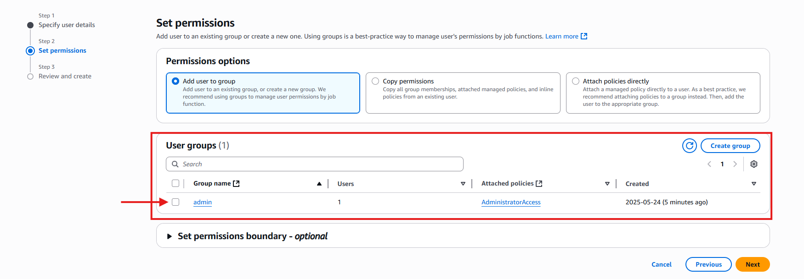
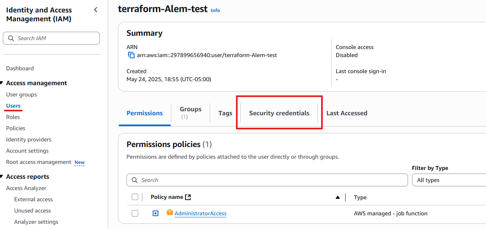
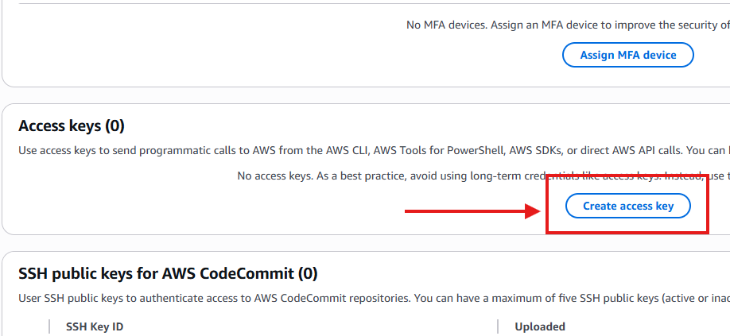
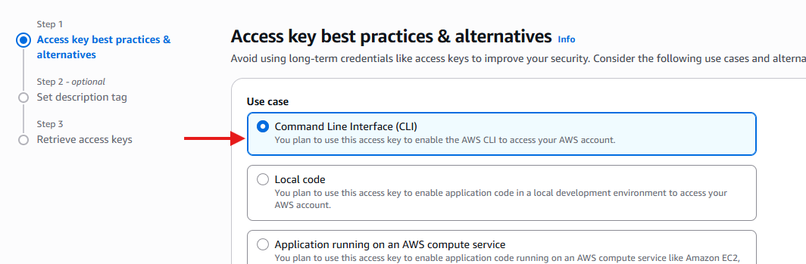

# Acceso de terraform en AWS

## 1. Crear un usuario


## 2. Asignar roles

Normalmente se agrega un rol de **admin** para tener control de todas las funcionalidades.



## 3. Creación de llaves de cceso







Al final se tendrá que copiar la **Access key** y **Secret key** para tenerlas en **terraform**
(no compartirlas)


- El **access-key** es visible todo el tiempo.

- El **secret-access-key** solo puede ser visto al crear la llave de acceso, luego es imposible de conocer.

### Creación de alias

para más comodidad en tu entorno de trabajo coloca este comando en consola o en algun archivo de configuraciones.

```bash
# En windows
Set-Alias tf terraform
```
