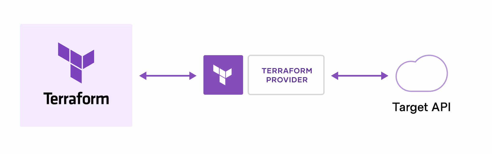
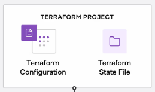
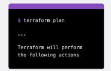

# Terraform

Terraform es un herramienta que permite crear infraestructura como código.



Terraform se interpondrá entre nosotros y la API del proveedor de nube (aws, azure, google cloud, etc) o de manera local, utilizando **terraform providers**.

## Ventajas

- Manejo de infraestructura

- Automatización de cambios.

- Estandarizar configuraciones.

- Colaboración entre diferentes personas que estén manipulando nuestra infraestructura.

## Terraform Workflow

**Write:** Defines los recursos a utilizar mediante archivos de configuración.



**Plan:** Terraform, mediante comandos, puede crear, actualizar o destruir la infraestructura definida en tu configuración.



**Apply:** Terraform prueba y enlista la infraestructura que configuraste, y actualiza los estados de los archivos.


## IAM

----

## Comandos de Terraform

1. [Terraform init](#terraform-init)

2. [Terraform fmt](#terraform-fmt)

3. [Terraform plan](#terraform-plan)

4. [Terraform apply](#terraform-apply)

5. [Terraform destroy](#terraform-destroy)

6. [Terraform.tfvars](#terraformtfvars)

## Comandos de Variables

1. [Asignación](#asignación-de-variables)

2. [Tipos de colecciones](#collection-types)

3. [Flags](#flags)

----

## Comandos

### terraform init

Inicializa el backend, crea 2 archivos de manera local.

```bash
# Descarga información de proveedores y modulos
carpeta: .terraform/providers/...

# Guarda la información del estado
archivo: .terraform.lock.hcml
```

### terraform fmt

Le da formateo estándar a todos los archivos `example.tf`.

Útil para automatizar el formato de archivos en terraform en pipelines.

### terraform plan

Muestra lo que terraform creará luego de colocar `terraform init`.

Muestra los cambios que se hagan entre la infraestructura ya creada y los cambios que se proponen.

### terraform apply

Crea la infraestructura que inicializamos en todos nuestros archivos mediante terraform.

```bash
# No pregunta si vas a querer aplicar o no los cambios
terraform apply -auto-approve
```

### terraform destroy

Destruye toda la infraestructura que maneja y conoce.

### terraform.tfvars

Manera óptima, usada en pipelines, para cargar automaticamente variables a terraform.

**ejemplo:**

```bash
variable-random = "hello!"
```

## variables

La creación de variables tendrá el siguiente template:

```bash
variable "nombre"
{
  description = "descripcion de ejemplo"
  type        = # string, int, etc
  sensitive   = true or false # no se muestra en consola
  default     = "example" # valor por defecto al ejecutar la variable
}
```

### Asignación de variables

```bash
# forma estandar
example = var.example

# usando locals

# dentro de mi main.tf...
locals # variables que solo se pueden ejecutar de forma local
{
    tag = "saludo"
}
resource "instance" "name"
{
    tags = 
    {
        hola = local.tag # variable local
    }
}
```

### Collection types

- lists

```bash
variable{
    type = list(string)
}
```

- maps

```bash
variable{
    type = map(string)
}
```

- sets

```bash
variable{
    type = set(number)
}
```

- **Nota**:
si la variable tiene **TF_VAR_** name, este tomará automaticmente el nombre y el valor de la variable.

### Flags

```bash
# 
terraform apply -var
# 
terraform apply -var-file
```

## Modulos de terraform

colección de archivos de configuración estándar en un directorio dedicado.

El uso de modulos es un forma de extender la configuración actual de Terraform con partes existentes de código reutilizable.

**Observación:** permite añadir varios archivos de configuración utilizando solo uno

### Modulos conocidos

<https://registry.terraform.io/providers/terraform-aws-modules/http/latest>

## Estructura de archivos

### Estructura separada

1. Separación del Backend.

    Ventajas:

    1.1. Seguridad.
    1.2. Error humano reducido.

2. El código representa el estado de la infraestructura.

    Desventajas:

    2.1. Se requere multiples pasos par provisionar la infraestructura.
    2.2. Repetición de código.

### Estructur de workspaces

1. Reduce duplicación de código

    Desventajas:

    1.1. Error humano.
    1.2. Estado guardado en el backend.
    1.3. El código no muestra el estado de la infraestructura.

2. Comandos

```bash
    # enlista todos los workspaces
    terraform workspace list # default

    # creación de un nuevo workspce
    terraform workspace new <nombre>
    # Al crear te mandará al nuevo workspace inmediatamente
    # parecido a git checkout -b <nueva_rama>

    terraform workspace select <nombre>
    # cambia de workspace


```
